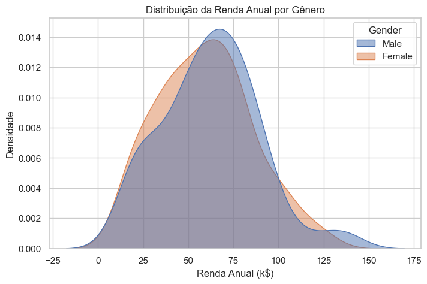

# 🛍️ Análise e Segmentação de Clientes de Shopping


Este projeto aplica técnicas de **Machine Learning (Aprendizado Não Supervisionado)** para segmentar clientes de um shopping center com base em seus comportamentos de compra e renda anual. O objetivo é identificar grupos distintos (clusters) para direcionar campanhas de marketing mais eficazes.

----



## 📋 Índice:
- [Sobre o Projeto](#-sobre-o-projeto)
- [Dataset](#-dataset)
- [Tecnologias Utilizadas](#-tecnologias-utilizadas)
- [Metodologia](#-metodologia)
- [Principais Insights](#-principais-insights)
- [Como Executar](#-como-executar)

---

## 📖 Sobre o Projeto:

A segmentação de clientes é uma prática crucial para empresas que desejam otimizar suas estratégias de vendas. Neste notebook, utilizamos o algoritmo **K-Means** para agrupar consumidores com características semelhantes.

Os principais objetivos foram:
1. Analisar a distribuição dos dados demográficos e financeiros.
2. Determinar o número ideal de clusters.
3. Interpretar os perfis de cada grupo encontrado.

---

## 📊 Dataset:

O conjunto de dados utilizado foi o `Mall_Customers.csv`, contendo 200 registros com as seguintes variáveis:

| Coluna | Descrição |
| :--- | :--- |
| **CustomerID** | ID único do cliente |
| **Gender** | Gênero do cliente |
| **Age** | Idade do cliente |
| **Annual Income (k$)** | Renda anual em milhares de dólares |
| **Spending Score (1-100)** | Pontuação de gastos atribuída pelo shopping |

## 🛠 Tecnologias Utilizadas:

O projeto foi desenvolvido em **Python** utilizando as seguintes bibliotecas:

* **Pandas**: Manipulação e limpeza de dados.
* **Matplotlib & Seaborn**: Visualização de dados (gráficos de dispersão, distribuição, etc.).
* **Scikit-learn**: Construção do modelo de clusterização (K-Means).

---

## ⚙️ Metodologia:

1.  **Análise Exploratória de Dados (EDA):**
    * Verificação de valores nulos e tipos de dados.
    * Análise estatística descritiva (média de idade ~38 anos, renda média ~60k).
    * Visualização da distribuição de renda e score de gastos.

2.  **Pré-processamento:**
    * Seleção das variáveis relevantes para o modelo.

3.  **Clusterização:**
    * Aplicação do algoritmo **K-Means**.
    * Definição dos grupos de consumidores.
  
---

## 💡 Principais Insights:

Com base na segmentação final, foram identificados perfis estratégicos, como por exemplo:

* **Cluster 1 (Alto Poder Aquisitivo):** Clientes com alta renda e alto score de gastos. 
    * *Ação sugerida:* Campanhas para produtos de luxo e atendimento VIP.
* **Cluster 2 (Oportunidade):** Clientes com características específicas que podem ser exploradas em eventos promocionais.
* **Demografia:** Identificou-se que 54% dos compradores do grupo de alta renda são mulheres, sugerindo um direcionamento de marketing visual e de produtos.

*(Os resultados completos e gráficos detalhados estão disponíveis no notebook)*

---

## 🚀 Como Executar:

1. Clone este repositório:
   ```bash

   git clone [https://github.com/seu-usuario/seu-repositorio.git](https://github.com/TayschreN/shopping-clients-pandas)

---

## Aprendizado:

Este projeto foi desenvolvido acompanhando a aula disponível neste vídeo: https://youtu.be/iwUli5gIcU0?si=AXtUYrGN_VltteeN.
Ao longo do projeto, aprofundei meus conhecimentos em conceitos e técnicas importantes 
Recomendo fortemente para quem deseja evoluir seus estudos em Data Analytics e Pandas.


